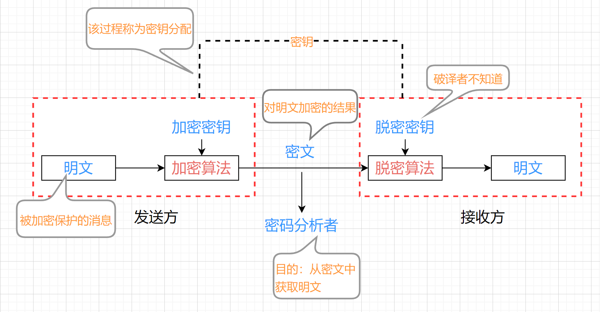

# 密码学基础

## 目录

1. 密码学的基本概念和基本编码技术
2. 完全保密的充要条件
3. 多余度和唯一解码量
4. 计算复杂性理论简介
5. Walsh普理论1
6. Walsh普理论2
7. 移位寄存器序列简介
8. 序列密码的基本模型和滤模型
9. 非线性组合模型
10. 钟控模型和有记忆变换模型
11. 分组密码与DES密码算法
12. DES算法分析
13. IDEA算法
14. 高级加密标准AES
15. AES算法的简单分析
16. 分组密码工作模式
17. RSA公钥密码算法
18. RSA的安全性分析
19. D-H密钥交换协议和Elgamal公钥
20. 椭圆曲线公钥密码体制
21. 数字签名
22. 杂凑函数
23. 认证技术
24. 随机数的产生与检验
25. 密钥管理

## 第1讲--密码学的基本概念和基本编码技术

主要内容：

- 密码学的基本目标
- 密码学的主要分支
- 加密算法的一些基本概念
- 最基本的破译方法--穷举攻击
- 最基本的三个编码技术

### 1.1 密码学的基本目标

先看这么一个通信模型：由一个信源和一个信宿构成，信源通过一条公开的信道将消息发送给对方，在信道上有一个敌手会对信源发送的消息进行攻击。

敌手的攻击方法可以有两种：（1）被动攻击(窃听)：获取但不改变传输的信息；（2）主动攻击：不仅窃听，而且还改变传输的信息，目的是实现伪造和欺骗。（我们不考虑破坏信道的主动攻击行为。）

对抗窃听的技术：**加密技术**。即在信源将消息发送前，利用加密算法将这条消息进行加密，然后将加密后的结果放到信道上进行传输，当对方收到加密结果之后，利用相应的脱密算法对其进行脱密获得消息。而敌手只能在信道上获得加密后的结果，此时加密后的消息已经变得面目全非了。

由此，我们得出，密码学要解决的第一个基本问题：**信息的机密性**问题——能解决信息的传输保密和存储保密问题。

对抗主动攻击的技术：**认证技术**。即在信源对消息添加认证码，然后将消息和消息认证码一起发送给对方，对方收到之后，要检验认证码与消息是否匹配，如果匹配就认为这条消息是正确的消息，如果不匹配就认为消息或者验证码遭到篡改。敌手在信道上进行攻击，对消息或验证码进行篡改也就没有意义。

由此，我们得出，密码学要解决的第二个基本问题：信息的**真实性认证**问题（能检测出主动攻击）。真实性认证包括以下几个方面：（1）发送方的身份；（2）接收方的身份；（3）内容的真伪；（4）时间的真伪。

对抗抵赖的技术：不同于上面的模型（上面的模型是双方互相信任的，防范的是第三方的攻击），这个时候产生的是互不信任的双方的认证问题。例如，如果我收到你给我的一份订货合同或者电子借款收据，但是，事后你不承认这份订货合同怎么办？谁来裁决这份订货合同的真伪？

信源在发送消息的时候（这个消息此时就是一个承诺，如合同），添加一个认证码，将认证码一起发给对方，添加的这个认证码是有要求的，即，添加认证码后能让所有人都可识别承诺的真伪。信宿收到消息和认证码之后，可以检验认证码和消息手否匹配。

由此，我们得出，密码学要解决的第三个基本问题：承诺的**不可否认性**问题。

综上，密码学的基本目标就是解决信息安全的三个基本安全需求，即：

1. 信息的机密性保证；（由加密算法完成）
2. 信息的真实性认证；（由认证算法和配套的协议完成）
3. 承诺的不可否认性认证。（由数字签名算法、配套的协议和仲裁机构完成）

密码学是确保军事信息安全的核心技术。

### 1.2 加密算法的一些基本概念

对敌手攻击能力的基本假设：

- 思想：假设敌手具有最强的攻击能力。
- Kerchkhoffs假设：假设敌手知道除密钥之外的所有知识。
- 即要求密码算法应当使得：一切的秘密蕴于密钥之中。

对敌手攻击能力的Kerckhoffs假设：假设敌手知道：

1. 所使用的密码算法，它包括5个方面：

   1. 加密算法Ek(m)

   2. 脱密算法Dk(c)

   3. 明文空间M

   4. 密文空间C

   5. 密钥空间K

      这5个方面可以用函数形式表示，即从明文空间到密文空间的一个函数，Ek：M —> C，这个函数就是加密算法，其中的参数就是密钥，明文的取值范围就是明文空间M，密文的取值范围就是密文空间C，参数的取值范围就是密钥空间。

2. 知道明文的概率分布规律；
3. 知道密钥的概率分布规律；
4. 知道所有可能的破译方法。

如此假设的原因：（1）我们不能保证敌手得不到这些信息，绝对不能赌；（2）如果在这么优越的条件下仍然不可破译，说明密码算法在实际中将会更加安全；（3）对于实现性能相同的两个密码算法，我们一定选择强度高的密码算法。

三类主要的攻击方法：（分类方法：按敌手可利用知识的类别分类）

1. 唯密文攻击：敌手除加密算法、明文和密钥的概率分布外，还知道很多由同一个密钥加密的密文；
2. 已知明文攻击：敌手除具备唯密文攻击的条件外，还知道许多密文对应的明文。
3. 选择明文（密文）攻击：敌手除具备已知明文攻击的条件外，还可任意选择对他有利的明文（密文），并能得到相应的密文（明文）。

### 1.3 最基本的破译方法--对密钥的穷举攻击

如果没有密钥会怎么样？——谁都可以脱密。

如果可能的密钥太少会怎么样？——如果对每个可能的密钥都逐个测试，则一定可以碰到正确的密钥，利用它就可脱密。这就是穷举攻击方法。

穷举攻击就是逐一利用每个可能的密钥对密文进行脱密测试，并将脱密结果最合理的那个密钥判断为正确密钥。何为最合理？——与攻击者掌握的明文的信息最吻合。

可能密钥总数的安全界限：

要想能抵抗穷举攻击，一个加密算法的可能密钥总数不能太少。目前，可能密钥的总数少于264的密码算法不能对抗穷举攻击，因而是不安全的。（64个二级制数能够表示的数的总数即为264）

可能密钥的总数为2128的密码算法是能够对抗穷举攻击的。

- 为什么“可能密钥的总数为2128的密码算法是能够对抗穷举攻击的”？

  - 假设可能密钥的总数为2128，现在考察该加密算法抗穷举攻击的能力。

  - 假设一台计算机每秒能检测230个密钥。一年=365x24x3600秒=3.15x107秒，故1年可检测3.15x107x230=255个密钥。而264=255x29，所以密钥的总数少于264264的密码算法不能对抗穷举攻击，因而是不安全的。而对于密钥的总数为2128的密码算法，需要2128 ÷ 255 = 273 = 1022年，即一万亿亿年，才可能将所有可能密钥测试一遍。

    即使计算能力再增加1千亿倍（1012），也需要1010年，即十亿年，才可能将所有可能密钥测试一遍。

穷举攻击是最笨、但往往也是最有效的攻击方法。例如：用生日、电话号码当密码，很容易破解。这里，提到最有效，怎么衡量它——四个指标：用攻击方法所需要的计算量、存储量、已知的数据量和成功率衡量。

密码算法设计的最理想境界就是让所有可能的破译方法都比穷举攻击更无效。——谁证明？设计者应先给出证明。

安全的密码算法应能够对抗所有可能的攻击方法。——能让所有可能的攻击方法失效（用攻击方法所需要的计算量、存储量、已知的数据量和成功率衡量）。

### 1.4 密码学的三个主要分支

- 分支一：密码编码学
  - 研究密码算法的编制技术。
  - 更确切的说，是研究安全、高效的信息加密算法和信息认证算法的设计理论与设计技术。
- 分支二：密码分析学
  - 密码分析学的主要任务是研究密码破译的理论与技术。
  - 密码破译包括信息加密算法的破译和信息认证算法的破译。
  - 信息加密算法的破译目的是获取被加密的信息；信息认证算法的破译目的是伪造合理的消息，以达到伪造和欺骗的目的。
  - 密码算法对抗密码破译的能力称为密码算法的保密强度。
- 分支三：密钥管理学
  - 密钥管理学是研究密钥的生成、分配与管理的理论、技术和方法的科学。

### 1.5 密码算法最基本的三个编码技术

#### 1.5.1 信息加密的一般流程和基本编码技术分类

信息加密的一般流程：

基本编码技术的分类：

1. 代替密码

   利用预先设计的代替规则，对明文逐字符或逐字符组进行代替的密码。分为单表代替和多表代替两种。

2. 移位密码

   对各字符或字符组进行位置移动的密码。

3. 加减密码

   将明文逐字符或逐字符组与乱数相加或相减的密码。

#### 1.5.2 单表代替密码：

利用预先设计的**固定**代替规则，对明文逐字符或逐字符组进行代替的密码。

- 其中， 固定是指代替规则只有一种，因而与密钥和被加密的明文字符的序号无关。故相同的明文字符组一定产生相同的密文字符组。
- 字符组称为一个代替单位。
- 代替规则又称为代替函数、代替表或S盒。

**例1**，汉字和符号的区位码：

由于上述对应关系是公开的，而且编码规律很强，因而它实际上是明码而不是密码。

**例2**，以十进制值数为代替单位的S盒：

S:{0, 1, 2, ..., 9} —>{0, 1, 2, ...,9}，如果S[10] = {5, 4, 8, 2, 1, 0, 9, 7, 3, 6}，即代替表为：

| 明文 | 0    | 1    | 2    | 3    | 4    | 5    | 6    | 7    | 8    | 9    |
| ---- | ---- | ---- | ---- | ---- | ---- | ---- | ---- | ---- | ---- | ---- |
| 密文 | 5    | 4    | 8    | 2    | 1    | 0    | 9    | 7    | 3    | 6    |

则对明文“晨五点总攻”的加密可分为两步：

（1）先将明文变换为区位码=1931 4669 2167 5560 1505；

（2）将编码结果加密成密文=4624 1996 8497 0095 4050。

脱密时执行上述过程的逆过程即可。

单表代替的缺点：明文字符相同时密文字符也相同。

**例3**，Caesar密码（凯撒密码）：

这是一种对英文字母逐字母加密的密码。将英文字母转化为数字的方法：转化为该字母的序号：

| 英文 | A    | B    | C    | D    | ...  | V    | W    | X    | Y    | Z    |
| ---- | ---- | ---- | ---- | ---- | ---- | ---- | ---- | ---- | ---- | ---- |
| 数字 | 0    | 1    | 2    | 3    | ...  | 21   | 22   | 23   | 24   | 25   |

加密变换为：c=E3(m) = (m +3) mod 26，0 <= m <= 25。

即：

| 明文字母 | A    | B    | C    | D    | ...  | V    | W    | X    | Y    | Z    |
| -------- | ---- | ---- | ---- | ---- | ---- | ---- | ---- | ---- | ---- | ---- |
| 密文字母 | D    | E    | F    | G    | ...  | Y    | Z    | A    | B    | C    |

脱密变换为：m = D3(c) = (c - 3) mod 26，0 <= m <= 25。

如，明文cipher——>密文flskhu。

**单表代替密码的优缺点分析：**

- 优点：明文字符的形态一般将面目全非（形态变）。
- 缺点：明文的位置不变；明文字符相同，则密文字符也相同，从而导致：（1）若明文字符e被加密成密文字符a，则明文中e的出现次数就是密文中a的出现次数；（2）明文的跟随关系反映在密文之中。因此，明文字符的统计规律就完全暴露在密文字符的统计规律之中。

#### 1.5.3 多表代替密码：

单表代替的缺点是：只要两个明文字符组相同，则对应的密文字符组一定相同。

多表代替密码可以克服这个缺点。

根据密钥的指示，来选择加密时使用的单表的方法，称为多表代替密码。

**例4**，加密变换为c=Ek(m) = (m +k) mod 10，但k不是固定常数而是密钥。加密算法：

| 明文     | 晨   | 五   | 点   | 总   | 攻   |
| -------- | ---- | ---- | ---- | ---- | ---- |
| 明文序列 | 1931 | 4669 | 2167 | 5560 | 1505 |
| 密钥序列 | 4321 | 5378 | 4322 | 3109 | 1107 |
| 密文序列 | 5252 | 9937 | 6489 | 8669 | 2602 |

表中，晨对应的汉字区位码为1931，利用给定的密钥序列4321，根据加密算法将每一位转换为密文，如第一位是(1+4)mod10=5。

如果密钥序列是随机的，该密码称为一次一密体制，它就是绝对安全的，不可破译（因为即使密文已知，明文取每个值也都是等可能的）。随机就是指序列的信号相互独立且等概览分布。

**一次一密的密码体制的一般结构：**

拉丁方变换的含义：拉丁方表的各列、行互不相同。例如：

| f(k, m) | m = 1 | m = 2 | m = 3 | m = 4 |
| ------- | ----- | ----- | ----- | ----- |
| k = 1   | 1     | 2     | 3     | 4     |
| k = 2   | 2     | 3     | 4     | 1     |
| k = 3   | 3     | 4     | 1     | 2     |
| k = 4   | 4     | 1     | 2     | 3     |

意义：即使密钥相同（如，k=1），不同的明文也被加密成不同的密文（如，m=1, 2, 3加密后不同）；即使明文相同（如，m = 1），不同的密钥也将之加密成不同的密文（如，k = 1, 2, 3, 4 加密后不同）。

一次一密的密码体制的缺点：

- 密钥序列是随机序列意味着：（1）密钥序列不能周期重复；（2）密钥序列必须与明文序列登场；（3）这些密钥序列必须在脱密前分配完毕；（4）大量通信时不实用；（5）分配密钥和存储密钥时安全隐患大。
- 解决方案：密钥序列由少量真随机的数按固定的算法生成，只要它很像随机序列即可。这种序列称为伪随机序列。其中，很像，意味着求不出该序列不像随机的地方。

#### 1.5.4 序列密码算法的基本结构

#### 1.5.5 移位密码

移位密码就是对明文字符或字符组的进行位置移动的密码。

例如，设明文为：密码学基本知识。移位方式：S[7] = {2, 5, 7, 3, 4, 1, 6}，即：第i个密文汉字就是第S[i - 1]个明文汉字（S[i-1]表示的是值域中即{}中的值）。则密文为：码本识学基密知。（密文的第1个字由明文的第2个，密文的第2个由明文的第5个，密文的第3个由明文的第7个...）

移位是设计现代密码常用或必用的一种编码技术。

**移位密码与代替密码的优缺点对比：**

1. 移位密码的优点：明文字符的位置发生变化。

   移位密码的缺点：明文字符的形态没有改变。

2. 代替密码的优点：明文字符的形态发生变化。

   代替密码的缺点：明文字符的位置没有改变。

由此，我们可以考虑优缺点互补，交替使用代替和移位形成的密码算法：首先将明文分成各个小分组，然后对各个小分组逐块使用代替密码加密，加密完之后，按逐字符移位变换，把加密结果进行位置的错乱。然后再重新分组，再次进行逐块代替，然后再利用移位进行位置错乱......这样不断地交替使用代替密码与移位密码。

#### 1.5.6 加减密码——一种特殊的代替密码

**例5**，加密变换为：c=Ek(m) = (m + k) mod 10，这里k可以是固定常数，也可以是密钥。明文空间：{0, 1, 2, ..., 9}，密文空间：{0, 1, 2, ..., 9}，密钥空间：{0, 1, 2, ..., 9}。脱密变换：m = Dk(c)= (c - k) mod 10。

**例6**：双减密码：加密变换为c = Ek(m) = (m - k) mod 10，脱密变换为m = Dk(c)= (k - c) mod 10。

**例7**，仿射密码：设矩阵A=(aij)nxm是由密钥定义的环Z/(m) = {0, 1, 2, m-1}上的n级可逆方阵，明文x=(x1, x2, ..., xn)是Z/(m)的n维向量，且密文y=(y1, y2, ..., yn)满足方程组：

> y1 = (a11x1 + a12x2 + ... + a1nxn) mod m
>
> y2 = (a21x1 + a22x2 + ... + a2nxn) mod m
>
> ...
>
> yn = (an1x1 + an2x2 + ... + annxn) mod m

则称该密码是仿射密码。

在已知明文条件下，可通过解方程组的方法求出矩阵A，从而攻破仿射密码。

交替使用代替密码和仿射密码可以形成很强的密码算法：明文首先经过密钥控制的逐块代替密码，再经过密钥控制的仿射变换，再经过密钥控制的逐块代替密码，再经过密钥控制的仿射变换，...，形成密文。

### 1.6 小结

1. 密码学的基本目标是解决信息的机密性保证、真实性认证和承诺的不可否认性这三个基本的安全需求；
2. 对敌手破译能力的假设是知道除密钥外的一切信息；
3. 密码学有密码编译、密码分析和密钥管理三个分支；
4. 加密算法应能对抗所有可能的攻击方法；
5. 对密码算法最基本的攻击方法是穷举密钥攻击；
6. 代替、移位和加减是密码算法最基本的编码技术；
7. 理论上不可破译的密码算法是存在的——一次一密；
8. 序列密码脱胎于一次一密；
9. 利用弱的密码变换可搭配成强度很高的加密算法；
10. 代替密码与移位密码结合、代替密码与加减密码结合都可以形成强度很高的加密算法，这是分组密码的基本模型。

## 第2讲 Shannon保密理论(1) 完全保密的充要条件

主要内容：

- 熵的概念及其性质
- 密码体制的完全保密性
- 多余度和唯一解距离

### 2.1  熵的概念及其性质

#### 2.1.1 熵的概念：

信息是什么？

1. 当未知的变成已知的之后获取的信息；
2. 当未知的还没变成已知之前包含的未知信息。

谁的信息？

- 一个随机事件（实验）包含的信息。
- 本质上是一个概率分布蕴含的信息。

**定义**（**随机事件的熵**）：设一个实验X有x1，x2，...，xn 共n个可能的结果，则称自信息量 I(xi) = -logp(xi) 的数学期望

$$
H(X) = \sum_{i=1}^{n}p(x_i)I(x_i) = - \sum_{i=1}^{n}p(x_i)logp(x_i)
$$
为实验X的**熵(Entropy)**。其中约定0log0 = 0。

- 因此，一个实验的熵就是该实验的每个可能结果包含的自信息量 I(xi) 的平均值。
- 熵由概率分布p唯一确定，因而熵本质上是概率分布的熵。
- 熵就是一个概率分布所包含的未知信息量。

#### 2.1.2 熵的主要理论：

- 熵：
  $$
  0 \leq H(X) = - \sum_{i=1}^{n}p(x_i)\log_bp(x_i) \leq log_bn;
  $$

- 联合熵：
  $$
  H(X, Y) = -\sum_{i=1}^{n}\sum_{j=1}^{m} p(x_i, y_j) logp(x_i, y_j) logp(x_i, y_j)
  $$

- 条件熵：
  $$
  H(X | Y) = -\sum_{i=1}^{n}\sum_{j=1}^{m} p(x_i, y_j) logp(x_i, y_j) logp(x_i| y_j)
  $$

- 定理：
  $$
  H(X,Y) = H(Y) + H(X|Y)
  $$

- 定理：
  $$
  H(X,Y) \leq H(X) + H(Y). 
  等号成立 \Longleftrightarrow X与Y独立
  $$

- 定理：
  $$
  H(X|Y) \leq H(X). 等号成立 \Longleftrightarrow X与Y独立
  $$

- 平均互信息：
  $$
  I(X; Y) = H(X) + H(Y) - H(X, Y)
  $$

- 结论：
  $$
  I(X; Y) = H(X) - H(X|Y) = H(Y) - H(Y|X) \geq 0. 等号成立 \Longleftrightarrow X与Y独立
  $$

### 2.2 Shannon保密理论

主要内容：

- 利用Shannon信息论，研究密文能够提供的明文和密钥的信息量；
- 分析在**唯密文攻击**条件下，要唯一确定密钥时最少需要的平均密文长度。

#### 2.2.1 密码体制的数学模型

一个密码体制由明文空间、密文空间、密钥空间、加密算法和脱密算法共五部分构成，且假设：

（1）**被加密的明文**是明文空间上服从某个已知**概率分布**pm(x)的随机变量；

（2）**被使用的密钥**是密钥空间上服从某个已知**概率分布**pk(x)的随机变量；

=>密文也是密文空间上服从某个给了分布pc(x)的随机变量；

我们还假定：密钥的分布与明文的分布独立。

我们将研究密文能够提供的明文和密钥的信息量。

#### 2.2.2 理论上的保密性

理论上的保密性是在不考虑密码分析者的攻击时间和所需设备能否实现的假设下，研究密码体制相对于唯密文攻击的安全性。

因此，从信息论上讲，理论上的保密性考查的是唯密文攻击方法平均所能获得的最大信息量。

> 补充：加密算法的安全性
>
> 假设攻击者已知加密算法的实现细节，在未知密钥的情况下，攻击密码系统的强度由弱到强的四种基本攻击：
>
> - 唯密文攻击（Ciphertext-only attack）：分析者通过同一密钥加密的密文，恢复出明文或密钥。
>
> - 已知明文攻击（Known-plaintext attack）：分析者通过同一密钥加密的明文/密文对，恢复出其他密文的明文或者密钥。（攻击者拿到的明文/密文对不是由攻击者决定的）
>
> - 选择明文攻击（Chosen-plaintext attack）：分析者可以根据破解需要，选择系列明文并获得对应的密文，恢复出其他密文的明文或者密钥。（攻击者拿到的明文/密文对是可以由攻击者选择的）
>
> - 选择密文攻击（Chosen-ciphertext attack）：分析者可以根据破解需要，选择系列密文并获得对应的明文，恢复出其他密文的明文或者密钥。

**定义**：设M和C分别是一个密码体制的明文空间和密文空间中的明文和密文，如果I(M;C)=0，则称该密码是完全保密的。完全保密又称为理论保密。

**定理**：以下5个条件是等价的：

1. 一个密码体制是完全保密的；

2. I(M; C) = 0; （明文与密文不互相提供信息）

3. H(M | C) = H(M); （已知密文不降低明文的熵）

4. H(C | M) = H(C); （已知明文不降低密文的熵）

5. 明文与密文独立，即
   $$
   \forall  a \space \epsilon \space M, \forall b \space \epsilon \space C,只要p(c=b) \neq 0, 就有p(m=a|c=b) = p(m=a).
   $$
   它等价于
   $$
   \forall  a \space \epsilon \space M, \forall b \space \epsilon \space C,只要p(m=a) \neq 0, 就有p(c=b|m=a) = p(c=b).
   $$

两个问题：

- 问题1，由密文求不出明文的条件是什么？
  - 刻画手段：I(M; C) 或 H(M|C)

- 问题2，由密文求不出密钥的条件是什么？
  - 刻画手段：I(K; C)或 H(K|C)

- 二者的关系？

下面首先在已知密文条件下，给出密钥熵H(K|C)与明文熵H(M|C)之间的关系。

**定理**：设M, K, C 分别是明文空间、密钥空间和密文空间上的随机变量，则有：
$$
H(K|C) = H(M|C) + H(K|M, C)
$$
直观含义：截获密文后密钥的未知信息量H(K|C)等于截获密文后明文的未知信息量H(M|C)与已知明密对M,C的条件下提供的密钥的信息量之和。

**证明**：
$$
\begin{align}
& 记P_c(x) = P(X=x | C=c)，则由概率论知，\\
& p_c(k,m) = p_c(m)p_c(k|m). \\
& 再由概率论知，p_c(k|m) = p(k|m,c),\\
& 从而有，p(k,m|c) = p(m|c)p(k|m,c). \\
& 进而有，\\
& H(K,M|C) = - \sum_{k,m,c}p(k,m,c)logp(k,m|c)\\ 
& = -\sum_{k,m,c}p(k,m,c)logp(m|c)p(k|m,c) \\
& = -\sum_{k,m,c}p(k,m,c)logp(m|c)-\sum_{k,m,c}p(k,m,c)p(k|m,c) \\
& =-\sum_{m,c}logp(m|c) - \sum_{k,m,c}p(k,m,c)p(k|m,c) \\
& = H(M|C) + H(K|M, C) \\
& 即，H(K,M|C) = H(M|C) + H(K|M,C) \\
& 同理，有，H(K,M|C) = H(K|C) + H(M|K,C) \\
& 下证 H(M|K,C)=0 \\
& 事实上，由于 p(m|k,c)=
	\{
	\begin{array}{lr}
	1， 若E(k, m) =c; \\
	0，若E(k, m) \ne c.\\
	\end{array} \\
& 从而，恒有，p(m|k,c)logp(m|k,c)=0 \\
& 故有，H(M|K,C) = -\sum_{k,c,m}p(m|k,c)logp(m|k,c) = 0. \\
& 这说明，H(K|C) = H(K, M|C) = H(M|C) + H(K|M,C) \\
& 证毕。
\end{align}
$$
**推论 (完全保密的必要条件)：**设M, C, K分别是明文空间、密文空间和密钥空间上的随机变量，则有，
$$
\begin{align}
& (1) H(K|C) \ge H(M|C); \\
& (2) I(M;C) = H(M) - H(M|C) \ge H(M) - H(K|C) \ge H(M) - H(K) \\
& (3)密码体制完全保密性的必要条件是：H(K) \ge H(M)
\end{align}
$$
密码体制完全保密的充要条件是什么？

下面在：

（1）明文空间、密文空间和密钥空间中点数相等；

（2）每个明文在明文空间中出现的概率都不是0；

（3）每个密文在密文空间中出现的概率都不是0.

这三个条件下，给出完全保密的密码体制的充要条件。

**定义**：设X, Y, Z都是具有n个点的有限集，f：X x Y —>Z。如果对任意x0∈X，任意y0∈Y，以y为变量的映射f(x0)是Y至Z的双射，且以x为变量的映射f(x,y0)是X至Z的双射，则称f是拉丁方变换。

**引理**：设E(k, m)是拉丁方变换，e∈K，x∈M 且 y=E(k, m)，则有：

（1）若 p(m=x) ≠ 0，则有 p(c=y | m=x) = p(k=e) （将后验概率归结为密钥的分布）

（2）若 p(k=e) ≠ 0，则有 p(c=y | k=e)=p(m=x)

